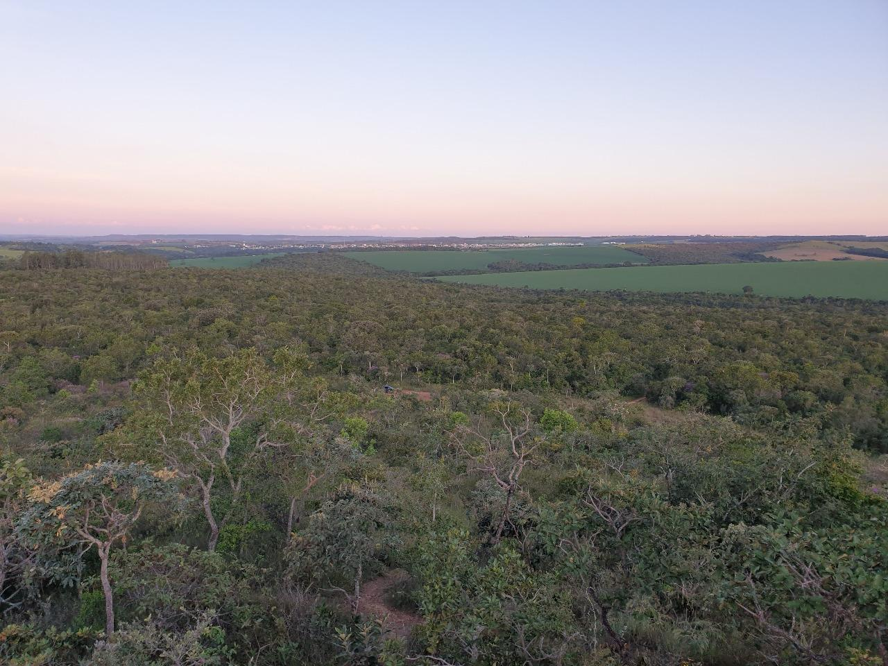
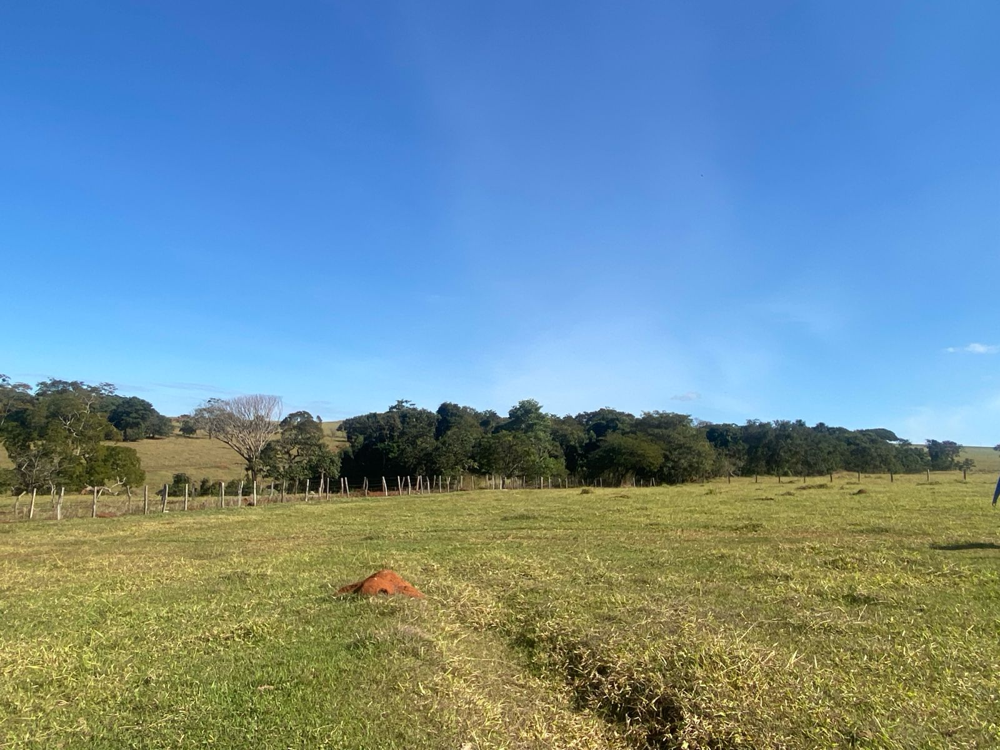

<h1>LAND LTER Project</h1>

LAND LTER (Agricultural Landscape Dynamics and Impacts on Biodiversity) is a Long-Term Ecological Research
(LTER) project under execution in the Brazilian Cerrado since 2016. This project assesses the interactions between agroecosystems and natural vegetation areas and their complexity in high-intensity
agricultural landscapes in the Cerrado. The landscape is a mosaic of crops, comprising mainly soybean, maize, millet, sorghum in crop rotation system, and pasturelands, interspersed by
small patches of natural vegetation remnants, such as savannas, forests, and wetlands.

  
  

We are assessing how spatial and temporal characteristics of agricultural landscapes can influence biodiversity and  its interactions, ecosystem functions, and ecosystem services. The biodiversity
has been analysed in a multi-taxon approach (plants - savannas and forests, freshwater organisms, helmint organisms, Euglossini bees, birds, small non-flying mammals, anurans, reptiles, 
and Medium and large mammals). Also, non-invasive methods for monitoring biodiversity have been used, such as genetic data (Environment DNA) and remote sensing data 
(optical remote sensing data and LIDAR).

**See LAND LTER publications here:**

  

**All biodiversity raw data obtained since 2016 are available in this repository for download.**

<h2>Contact us</h2>

📧landlter.project@gmail.com

📷 <a href="https://www.instagram.com/lab.collevatti/">@lab.collevatti</a>

